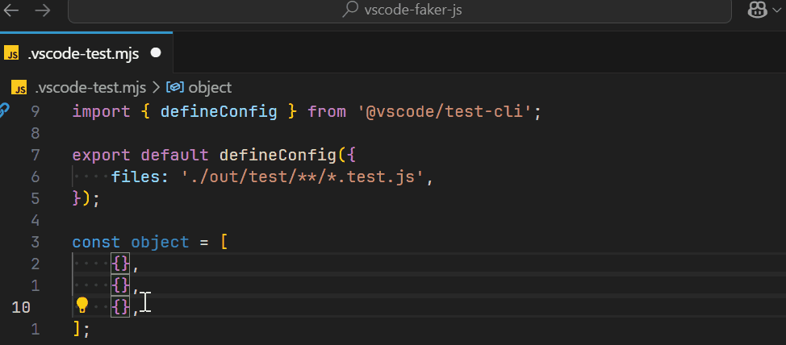
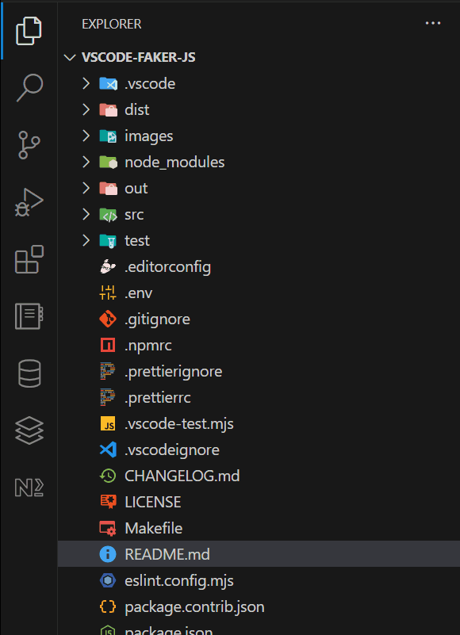

[url-faker]: https://github.com/faker-js/faker
[url-faker-locales]: https://github.com/faker-js/faker/blob/next/docs/guide/localization.md#available-locales

# Faker.js for Visual Studio Code

Generate massive amounts of fake (but realistic) data for testing and development with [Faker.js][url-faker].

## Usage



## Installation

1. Type `CTRL+SHIPT+P` for Windows or `CMD+SHIFT+P` for Windows to launch command palette;
1. Type `Extensions: Install Extensions` and press `Enter` to open marketplace (a.k.a extension view);
1. Search `Faker.js` extension and install it.



## Faker.js Locales

1. Type `CTRL+SHIPT+P` for Windows or `CMD+SHIFT+P` for Windows to launch command palette;
1. Type `Preferences: Open User Settings (JSON)` and press `Enter` to open `setting.json` file;
1. Pick available [locale][url-faker-locales]:

```json
{
    "faker-js.locale": "en" // by default
}
```

## Faker.js API

1. Type `CTRL+SHIPT+P` for Windows or `CMD+SHIFT+P` for Windows to launch command palette;
1. Type `Faker: <faker-js-function>` and press `Enter` to run Faker.js method;

Following `<faker-js-function>` methods are available:

-   `airline.airline`
-   `airline.airport`
-   `airline.airplane`
-   `airline.recordLocator`
-   `airline.seat`
-   `airline.aircraftType`
-   `airline.flightNumber`
-   `animal.dog`
-   `animal.cat`
-   `animal.snake`
-   `animal.bear`
-   `animal.lion`
-   `animal.cetacean`
-   `animal.horse`
-   `animal.bird`
-   `animal.cow`
-   `animal.fish`
-   `animal.crocodilia`
-   `animal.insect`
-   `animal.rabbit`
-   `animal.rodent`
-   `animal.type`
-   `animal.petName`
-   `book.author`
-   `book.format`
-   `book.genre`
-   `book.publisher`
-   `book.series`
-   `book.title`
-   `color.human`
-   `color.space`
-   `color.cssSupportedFunction`
-   `color.cssSupportedSpace`
-   `color.rgb`
-   `color.cmyk`
-   `color.hsl`
-   `color.hwb`
-   `color.lab`
-   `color.lch`
-   `color.colorByCSSColorSpace`
-   `commerce.department`
-   `commerce.productName`
-   `commerce.price`
-   `commerce.productAdjective`
-   `commerce.productMaterial`
-   `commerce.product`
-   `commerce.productDescription`
-   `commerce.isbn`
-   `company.name`
-   `company.catchPhrase`
-   `company.buzzPhrase`
-   `company.catchPhraseAdjective`
-   `company.catchPhraseDescriptor`
-   `company.catchPhraseNoun`
-   `company.buzzAdjective`
-   `company.buzzVerb`
-   `company.buzzNoun`
-   `database.type`
-   `database.column`
-   `database.collation`
-   `database.engine`
-   `database.mongodbObjectId`
-   `date.month`
-   `date.weekday`
-   `date.timeZone`
-   `date.anytime`
-   `date.past`
-   `date.future`
-   `date.between`
-   `date.betweens`
-   `date.recent`
-   `date.soon`
-   `date.birthdate`
-   `finance.accountNumber`
-   `finance.accountName`
-   `finance.routingNumber`
-   `finance.maskedNumber`
-   `finance.amount`
-   `finance.transactionType`
-   `finance.currency`
-   `finance.currencyCode`
-   `finance.currencyName`
-   `finance.currencySymbol`
-   `finance.bitcoinAddress`
-   `finance.litecoinAddress`
-   `finance.creditCardNumber`
-   `finance.creditCardCVV`
-   `finance.creditCardIssuer`
-   `finance.pin`
-   `finance.ethereumAddress`
-   `finance.iban`
-   `finance.bic`
-   `finance.transactionDescription`
-   `food.adjective`
-   `food.description`
-   `food.dish`
-   `food.ethnicCategory`
-   `food.fruit`
-   `food.ingredient`
-   `food.meat`
-   `food.spice`
-   `food.vegetable`
-   `git.branch`
-   `git.commitEntry`
-   `git.commitMessage`
-   `git.commitDate`
-   `git.commitSha`
-   `hacker.adjective`
-   `hacker.abbreviation`
-   `hacker.noun`
-   `hacker.verb`
-   `hacker.ingverb`
-   `hacker.phrase`
-   `helpers.fake`
-   `helpers.slugify`
-   `helpers.replaceSymbols`
-   `helpers.replaceCreditCardSymbols`
-   `helpers.fromRegExp`
-   `helpers.shuffle`
-   `helpers.uniqueArray`
-   `helpers.mustache`
-   `helpers.maybe`
-   `helpers.objectKey`
-   `helpers.objectValue`
-   `helpers.objectEntry`
-   `helpers.arrayElement`
-   `helpers.weightedArrayElement`
-   `helpers.arrayElements`
-   `helpers.enumValue`
-   `helpers.rangeToNumber`
-   `helpers.multiple`
-   `image.avatar`
-   `image.avatarGitHub`
-   `image.avatarLegacy`
-   `image.url`
-   `image.urlLoremFlickr`
-   `image.urlPicsumPhotos`
-   `image.urlPlaceholder`
-   `image.dataUri`
-   `internet.color`
-   `internet.url`
-   `internet.email`
-   `internet.exampleEmail`
-   `internet.userName`
-   `internet.username`
-   `internet.displayName`
-   `internet.protocol`
-   `internet.httpMethod`
-   `internet.httpStatusCode`
-   `internet.domainName`
-   `internet.domainSuffix`
-   `internet.domainWord`
-   `internet.ip`
-   `internet.ipv4`
-   `internet.ipv6`
-   `internet.port`
-   `internet.userAgent`
-   `internet.mac`
-   `internet.password`
-   `internet.emoji`
-   `internet.jwtAlgorithm`
-   `internet.jwt`
-   `location.timeZone`
-   `location.zipCode`
-   `location.city`
-   `location.buildingNumber`
-   `location.street`
-   `location.streetAddress`
-   `location.secondaryAddress`
-   `location.county`
-   `location.country`
-   `location.continent`
-   `location.countryCode`
-   `location.state`
-   `location.latitude`
-   `location.longitude`
-   `location.direction`
-   `location.cardinalDirection`
-   `location.ordinalDirection`
-   `location.nearbyGPSCoordinate`
-   `lorem.word`
-   `lorem.words`
-   `lorem.sentence`
-   `lorem.slug`
-   `lorem.sentences`
-   `lorem.paragraph`
-   `lorem.paragraphs`
-   `lorem.text`
-   `lorem.lines`
-   `music.genre`
-   `music.album`
-   `music.artist`
-   `music.songName`
-   `person.firstName`
-   `person.lastName`
-   `person.middleName`
-   `person.fullName`
-   `person.gender`
-   `person.sex`
-   `person.sexType`
-   `person.bio`
-   `person.prefix`
-   `person.suffix`
-   `person.jobTitle`
-   `person.jobDescriptor`
-   `person.jobArea`
-   `person.jobType`
-   `person.zodiacSign`
-   `phone.number`
-   `phone.imei`
-   `science.chemicalElement`
-   `science.unit`
-   `system.fileName`
-   `system.commonFileName`
-   `system.mimeType`
-   `system.commonFileType`
-   `system.commonFileExt`
-   `system.fileType`
-   `system.fileExt`
-   `system.directoryPath`
-   `system.filePath`
-   `system.semver`
-   `system.networkInterface`
-   `system.cron`
-   `vehicle.color`
-   `vehicle.vehicle`
-   `vehicle.type`
-   `vehicle.manufacturer`
-   `vehicle.model`
-   `vehicle.fuel`
-   `vehicle.vin`
-   `vehicle.vrm`
-   `vehicle.bicycle`
-   `word.adjective`
-   `word.noun`
-   `word.verb`
-   `word.words`
-   `word.adverb`
-   `word.conjunction`
-   `word.interjection`
-   `word.preposition`
-   `word.sample`

## Resources

-   [Azure: Project Page](https://my-visual-studio-code.visualstudio.com/vscode)
-   [VSCode Marketplace: Management Page](https://marketplace.visualstudio.com/manage/publishers/iibe)
-   [VSCode API: Extension Manifest](https://code.visualstudio.com/api/references/extension-manifest)
-   [VSCode API: Contribution Points](https://code.visualstudio.com/api/references/contribution-points)
